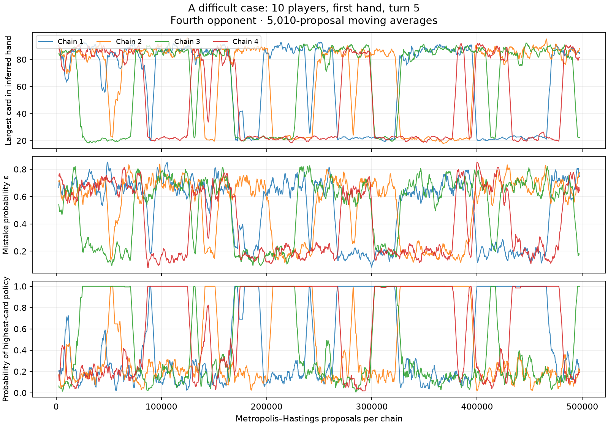

# MCMC budget calibration

Measured on 10 September 2026, using the current `emcee_independent_mh` implementation.
The production sampler was **not changed** during this study. Only development
instrumentation, documentation, and the example configuration changed.

## Recommended starting settings

For exploratory **2–5 player, mean-penalty, one- to three-turn** experiments:

```json
{
  "model": {
    "policies": ["lowest_card", "highest_card", "closest_gap"],
    "mode": "learned_mixture",
    "particle_count": 64,
    "burn_in_steps": 5000,
    "epsilon_proposal_scale": 2.5
  },
  "sample_count": 512
}
```

These fields are a fragment of the full [example configuration](../../examples/arena-uncertainty-players.json),
not a standalone player. Its continuation, row, horizon, objective, and fallback
settings remain explicit.

For a more expensive sensitivity check, compare **10,000 burn-in steps, 128 worlds,
and 2,048 rollouts**, keeping scale 2.5. These are exploratory starting points,
not universally sufficient budgets. In particular:

- Do not use the old 200-step example as a credible posterior approximation.
- There is **no validated general setting for ten-player games** with this kernel.
  A difficult case still failed diagnostics after 500,000 proposals per chain.
- More burn-in addresses initialisation; more worlds addresses posterior sampling
  variability; more rollouts addresses simulated action variability. They are not
  interchangeable.
- The recommendations concern mean penalties. Upper-tail/rare-event objectives,
  full-hand continuations, arbitrary custom opponents, and larger catalogues need
  their own decision-precision checks.
- With no behavioural evidence in the first turn of the first hand, the actual
  initial draws already follow the exact prior. Burn-in is not mathematically
  necessary in that special case. The bot's fixed setting still applies thereafter.

The current implementation is expensive at these settings: measured sampling alone
for 64 worlds and 5,000 proposals was roughly **7 seconds** in the two-player
late-hand case, **15–18 seconds** in the five-player mid-hand cases, and **70 seconds**
in the ten-player third-hand case. These are approximate wall times under concurrent
experiment load, not isolated throughput benchmarks; they exclude rollout costs.
Large arena sweeps should wait for a more efficient sampler.

## What was measured

The study covers **17 case configurations** and **21 full-trajectory runs**:

- 2, 5, and 10 players; first-hand turns 1, 5, and 9 where selected, plus third-hand turn 5.
- Controlled opponents cycling highest-card, lowest-card, and closest-gap policies.
- Deterministic opponents, a case with random-choice probability 0.35, and a second
  deal seed for the ten-player third-hand state.
- Single-policy, fixed-mixture, and learned-mixture modes; three- and eight-policy catalogues.
- Epsilon proposal scales 1, 2.5, and 4 in the five-player third-hand state.

`capture` uses ordinary player observations from arena games. It accumulates public
history through the same `PublicHistory` class used by the bot; it does not give
inference actual hidden hands. The observer follows closest-gap. Long games use a
high target score and an action cap so third-hand observations are available.

Four diagnostic chains start with random legal allocations and deliberately dispersed
epsilon values 0.01, 0.25, 0.75, and 0.99. We retain trajectories offline, unlike the
arena's one terminal draw per chain. emcee uses independent MH proposals here;
these chains do not use the interacting stretch-move ensemble algorithm.

We use ArviZ's array interface for rank-normalised split/folded R-hat, bulk ESS,
and 5%/95% tail ESS. We check each opponent's epsilon, policy one-hot indicators,
minimum/maximum/mean held card, and ownership of three representative unknown cards.
Arbitrary permutation-slot order is not an identifiable game quantity and is not
used as a diagnostic. Constant indicators are listed in the raw results rather
than assigned a misleading R-hat of 1. A constant trace cannot establish that an
unvisited rare mode is absent.

For fixed mixtures, all four diagnostic chains share one policy assignment. This
tests that conditional target; pooling different fixed assignments would compare
different targets and invalidate R-hat. It does not certify every fixed assignment.

We use **R-hat < 1.01 and bulk/tail ESS ≥ 400** as conservative screening criteria
for four chains, following [Stan's diagnostic guidance](https://mc-stan.org/learn-stan/diagnostics-warnings.html).
See the [ArviZ array diagnostic API](https://python.arviz.org/projects/stats/en/stable/api/generated/arviz_stats.base.array_stats.rhat.html).
Passing these checks is not proof of convergence. ESS is based on every tenth draw;
all proposal counts below refer to the original unthinned steps.

## Long-trajectory results

Each row reports the **worst** monitored nonconstant quantity in the stated final
window. These windows measure mixing and reference precision; they do not imply
that the burn-in value alone is sufficient for a single retained endpoint.

| Case | Discarded proposals | Following diagnostic proposals | Max R-hat | Min bulk ESS | Min tail ESS |
| --- | ---: | ---: | ---: | ---: | ---: |
| 2 players, hand 1, turn 9 | 100,000 | 200,000 | 1.0042 | 1,261 | 768 |
| 5 players, hand 1, turn 5 | 100,000 | 200,000 | 1.0093 | 571 | 178 |
| 10 players, hand 3, turn 5 | 100,000 | 200,000 | 1.0085 | 789 | 594 |
| 10 players, hand 1, turn 5 | 200,000 | 300,000 | 1.0604 | 58 | 60 |

The five-player reference passes the R-hat/bulk screen but not the tail screen.
Its means provide a useful comparison, with residual reference uncertainty; it is
not a fully certified tail posterior. The ten-player first-hand case is unsuitable
as a trustworthy reference. Shorter 30,000-proposal diagnostic windows also failed
the strict screen in the noisy, larger-catalogue, and second-seed tests; no universal
budget was established for them.



In the difficult ten-player case, one opponent's inferred hand, policy, and epsilon
switch together between distinct explanations. Chains can remain in one explanation
for tens of thousands of steps. This is a proposal-efficiency problem, not something
that a generic burn-in rule fixes.

The current proposal chooses one of a card swap, an epsilon update, or a policy
update. A global card swap often moves two undealt cards, or two cards already in
one hand, leaving the meaningful allocation unchanged. Independent policy/epsilon
moves can struggle to cross the low-probability region separating joint explanations.
Overall acceptance rates count these ineffective moves, so high acceptance alone
is not a reassuring diagnostic.

## Actual terminal-sample checks

Separately, we start **64 chains from the actual uniform priors**, retain their
endpoints at several budgets, and compare them with long-run means. This is closer
to the arena's inference procedure than the deliberately dispersed diagnostic starts.
Each endpoint comparison uses common candidate rollout randomness, one- and
three-turn horizons, and eight action draws per world. References use 1,024 sampled
worlds from the long runs and are approximate, not ground truth.

Maximum absolute error across opponents' estimated mean epsilon:

| Case | 200 steps | 1,000 steps | 5,000 steps | 10,000 steps |
| --- | ---: | ---: | ---: | ---: |
| 2 players, late first hand, scale 1 | 0.393 | 0.072 | 0.001 | 0.018 |
| 5 players, middle first hand, scale 1 | 0.465 | 0.341 | 0.013 | 0.031 |
| Same five-player state, another initialisation seed, scale 2.5 | 0.463 | 0.359 | 0.038 | 0.035 |
| 10 players, third hand, scale 1 | 0.341 | 0.046 | 0.012 | 0.013 |

The non-monotonic errors after 5,000 steps illustrate finite-world variability:
longer burn-in does not make a fixed collection of 64 terminal draws precise.
Small reference differences between runs also arise from resampling the reference
worlds. This is not a broad calibration test over independent deals.

At 200 steps, the five-player three-turn choice had approximately **0.99 additional
expected bull heads** under its reference estimates (0.75 in the scale-2.5 repeat).
Both five-player runs selected the reference's preferred three-turn card from
1,000 steps onward, even though epsilon estimates were still biased at 1,000.
Good decisions on a particular board do not establish a well-sampled posterior.

## Epsilon proposal scale

In the same five-player, third-hand case, using the final 30,000 proposals after
20,000 discarded proposals:

| Scale | Minimum epsilon bulk ESS | Maximum epsilon R-hat | Minimum bulk ESS across all quantities |
| --- | ---: | ---: | ---: |
| 1 | 511 | 1.0219 | 313 |
| 2.5 | 1,395 | 1.0043 | 275 |
| 4 | 1,482 | 1.0047 | 296 |

Scale **2.5** improved epsilon mixing without the larger step size of 4. It is a
reasonable starting value, not an optimum established across all cases. Allocation
mixing still limits the joint sampler.

## World and rollout precision

We built two cost banks, each with 1,024 long-run worlds and eight stochastic
three-turn rollouts per candidate per world. A nested bootstrap samples a finite
world bag and then the configured number of rollouts from that bag, repeated 1,000
times. This isolates approximate budget sensitivity **after** inference; it cannot
remove burn-in bias or reference error. The finite cost bank itself adds uncertainty.

For the five-player state, whose best card has a reasonably clear expected-cost gap:

| Worlds | Rollouts per candidate | Reference-best selection rate | Cost RMSE, bull heads |
| --- | ---: | ---: | ---: |
| 32 | 32 | 78.6% | 0.759 |
| 64 | 128 | 96.8% | 0.431 |
| 64 | 512 | 99.4% | 0.329 |
| 128 | 512 | 99.6% | 0.253 |
| 128 | 2,048 | 100.0% | 0.215 |

This supports 64 worlds / 512 rollouts as an exploratory starting point and shows
why spending everything on burn-in while keeping 32 rollouts is a poor balance.
These are conditional bootstrap frequencies, not measured arena win rates.

In the ten-player third-hand cost bank, the best two cards differ by only about
**0.057 bull heads**, and the reference itself cannot reliably resolve that gap.
Even 256 worlds / 2,048 rollouts selected the reference-best card only 48.9% of the
time; average reference-estimated regret was just 0.050 bull heads. The low exact
agreement here mainly reflects near ties. It would be misleading to treat it as
proof of poor gameplay or to chase 100% agreement by arbitrarily increasing budgets.

## Implications for the next implementation change

Before large arena sweeps or claims of calibrated risk estimates, improve the
proposal mechanism: avoid swaps that leave allocations unchanged, and consider
joint hand/policy/epsilon proposals or marginalising policy labels. Retaining useful
post-burn-in trajectories rather than restarting many chains for one sample could
also reduce cost, but then correlation and effective sample size must be accounted
for. Re-run these same cases after any change; these settings are specific to the
current kernel.

## Reproduction and evidence

The scripts use the existing game likelihood and emcee sampler; they do not
implement another MCMC or R-hat algorithm. `arviz-stats` is a development dependency.
The [raw JSON results](results/) retain per-variable diagnostics and experiment settings.
Large chain arrays are generated locally by the following commands and are not
committed. They are needed for endpoint and precision checks.

```bash
uv run python -m experiments.mcmc.diagnose \
  --players 5 --hand 1 --play 5 --steps 300000 --window 200000 \
  --output /tmp/sixnimmt-mcmc/reference-p5-h1-t5.json

uv run python -m experiments.mcmc.endpoint_check \
  --reference /tmp/sixnimmt-mcmc/reference-p5-h1-t5.json \
  --output /tmp/sixnimmt-mcmc/endpoint-p5-h1-t5.json

uv run python -m experiments.mcmc.precision_check \
  --reference /tmp/sixnimmt-mcmc/reference-p5-h1-t5.json \
  --output /tmp/sixnimmt-mcmc/precision-p5-h1-t5.json
```

`diagnose` also accepts `--noise`, `--seed`, `--scale`, `--mode`, and `--catalogue`.
Endpoint/precision checks currently support the three-policy learned mixture only.
Use the parameters in each result's `case` field to reproduce the remaining cases.
The generated NPZ files store every tenth trajectory draw; endpoint comparisons
use the portion after proposal 100,000.
